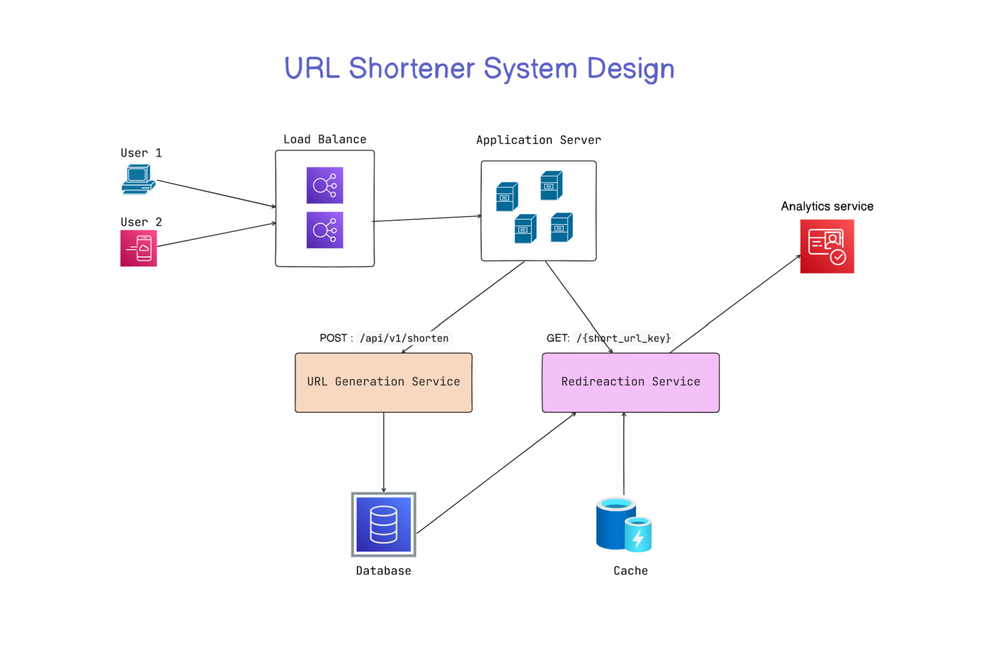

# 1. Requirements Gathering.

### 1.1 Functional Requirements:

-   Generate a unique short URL for a given long URL
-   Redirect the user to the original URL when the short URL is accessed
-   Support link expiration where URLs are no longer accessible after a certain period
-   Allow users to customize their short URLs (optional)
-   Provide analytics on link usage (optional)

---

### 1.2 Non-Functional Requirements:

-   High availability (the service should be up 99.9% of the time)
-   Low latency (url shortening and redirects should happen in milliseconds)
-   Scalability (the system should handle millions of requests per day)
-   Durability (shortened URLs should work for years)
-   Security to prevent malicious use, such as phishing.

---

---

# 2. Capacity Estimation

**Let’s assume the following traffic characteristics:**

1. **Daily URL Shortening Requests**: 1 million requests per day
2. **Read:Write ratio**: 100:1 (for every URL creation, we expect 100 redirects)
3. **Peak Traffic**: 10x the average load
4. **URL Lengths**: Average original URL length of 100 characters

---

### 2.1 Throughput Requirements :

-   **Average Writes Per Second (WPS)** : (1,000,000 requests / 86,400 seconds) ≈ 12
-   **Peak WPS**: 12 ×10 = 120

Since Read:Write ratio is 100:1

-   **Average Redirects per second (RPS)**: 12 \* 100 = 1,200
-   **Peak RPS**: 120 \* 100 = 12,000

---

### 2.2 Storage Estimation :

For each shortened URL, we need to store the following information:

-   **Short URL:** 7 characters (Base62 encoded)
-   **Original URL:** 100 characters (on average)
-   **Creation Date:** 8 bytes (timestamp)
-   **Expiration Date:** 8 bytes (timestamp)
-   **Click Count:** 4 bytes (integer)

Total storage per URL:

**Storage per URL:** 7 + 100 + 8 + 8 + 4 =127 bytes

Storage requirements for one year:

**Total URLs per Year:** 1,000,000 × 365 = 365,000,000
**Total Storage per Year:** 365,000,000 × 127 bytes ≈ 46.4 GB

---

### 2.3 Bandwidth Estimation :

Assuming the HTTP 301 redirect response size is about 500 bytes (includes headers and the short URL).

-   **Total Read Bandwidth per Day:** 100,000,00 \* 500 = 50 GB / day
-   **Peak Bandwidth:** If peak traffic is 10x average, the peak bandwidth could be as high as 500 bytes × 12,000 RPS = 6 MB/s

---

### 2.4 Caching Estimation

Since it’s a read-heavy system, caching can significantly reduce the latency for read requests.

If we want to cache some of the hot URLs, we can follow the 80-20 rule where 20% of the URLs generate 80% of the read traffic.

Since we have 1 million writes per day, if we only cache 20% of the hot urls in a day,
**Total cache memory required** = 1M × 0.2 × 127 Bytes = 25.4 MB.

**Assuming a cache hit ratio of 90%**, we only need to handle 10% of the redirect requests directly from the database.

**Requests hitting the DB:** 1,200 × 0.10 ≈ 120 RPS

This is well within the capabilities of most distributed databases like DynamoDB or Cassandra, especially with sharding and partitioning.

---

---

# 3. High Level Design

On a high level, we would need following components in our design:

1. **Load Balancer:** Distributes incoming requests across multiple application servers.

2. **Application Servers:** Handles incoming requests for shortening URLs and redirecting users.

3. **URL Generation Service:** Generates short URLs, handles custom aliases, and manages link expirations.

4. **Redirection Service:** Redirects the users to the original URL.

5. **Database:** Stores mappings between short URLs and long URLs.

6. **Cache:** Stores frequently accessed URL mappings for faster retrieval.

Analytics Service (optional): Tracks usage statistics like the number of clicks, geographic location, etc.



---

---

# 4. Database Design

### 4.1 SQL vs NoSQL

To choose the right database for our needs, let's consider some factors that can affect our choice:

**Database Requirements**

1. We need to store billions of records
2. Most database operations are key values lookups
3. Read queries is much higher than write
4. we don't need the join between tables
5. Database need to highly scalable and available

**_Given these points, a NoSQL database like DynamoDB or Cassandra is a better option due to their ability to efficiently handle billions of simple key-value lookups and provide high scalability and availability._**

### 4.2 Database Schema

We would need two tables: one for storing url mappings and one for storing user related information.


---

---

# 5. API Design

We'll design RESTful APIs that are intuitive, efficient, and scalable.

Let's break down our API design into several key endpoints:

### 5.1 URL Shortening API

**Endpoint: POST /api/v1/shorten**

This endpoint creates a new short URL for a given long URL.

##### Sample Request:


##### Sample Response:


---

### 5.2 URL Redirection API

**Endpoint: GET /{short_url_key}**
This endpoint redirects the user to the original long URL.

Sample Response:

```
HTTP/1.1 301 Moved Permanently Location:
https://www.example.com/some/very/long/url
```

---

---

# 6. Diving Deep into Key Components

## 6.1 URL Generator Service

The primary function of the service is to generate a short, unique URL for each long URL provided by the user.

### Considerations for Algorithm Selection:

-   **URL Length**: Shorter is generally better, but it limits the number of possible distinct URLs you can generate.
-   **Scalability**: The algorithm should work well even with billions of URLs.
-   **Collision Handling**: The algorithm should be able to handle duplicate URL generations.

---

### Approach 1: Hashing and Encoding

A common approach for generating short URLs is to use a hash function, such as MD5 or SHA-256 to generate a fixed-length hash of the original URL.

This hash is then encoded into a shorter form using Base62, which uses alphanumeric characters (A-Z, a-z, 0-9), providing a dense encoding space.

#### Example Workflow:

1. User submits a long URL:  
   `https://www.example.com/some/very/long/url/that/needs/to/be/shortened`
2. Generate MD5 hash:  
   `1b3aabf5266b0f178f52e45f4bb430eb`
3. Take first 6 bytes:  
   `1b3aabf5266b`
4. Convert to decimal:  
   `47770830013755`
5. Encode with Base62:  
   `DZFbb43`

A 7-character Base62 string can represent approximately 3.5 billion unique URLs (`62^7`).

#### Issues:

-   Generates same shortened URL for identical long URLs.
-   Rare collisions may occur where two different URLs produce the same hash.

#### Collision Resolution Strategies:

-   **Re-Hashing**: Re-hash with a different seed or use more bits from the hash.
-   **Incremental Suffix**: Append `-1`, `-2`, etc., until uniqueness is achieved.

---

### Approach 2: Unique ID Generation

Instead of hashing, use incremental IDs.

#### Workflow:

1. Each URL gets a unique, auto-incrementing ID.
2. Convert ID to Base62 encoded string.

#### Benefits:

-   **Collision-Free**: Unique sequential IDs.
-   **Simple**: Easy to implement and understand.

#### Considerations:

-   **Predictability**: Sequential IDs can be guessed.
    -   _Mitigation_: Add random seed or shuffle before encoding.
-   **Scalability**: Centralized ID generation can be a bottleneck.
    -   _Mitigation_: Use distributed ID generation (e.g., Twitter's Snowflake).

---

### Custom Aliasing

Users can specify their own short URL aliases.

#### Validation:

-   **Uniqueness Check**: Ensure alias is not already used.
-   **Character Validation**: Only allow alphanumeric characters, hyphens, etc.
-   **Reserved Aliases**: Prevent use of system-reserved words like `help`, `admin`.

#### Storage:

-   **Alias Mapping**: Map alias to original URL in database.
-   **Conflict Resolution**: Return error or suggest alternatives if alias is taken.

---

### Link Expiration

Allows URLs to expire after a specified time.

#### Handling:

-   **User-Specified Expiration**: Must be future-dated and within limits.
-   **Default Expiration**: Fallback if not specified (e.g., 1 year or forever).

#### Expiration Logic:

-   **Background Jobs**: Periodically mark/delete expired URLs.
-   **Real-Time Checks**: Validate expiration before redirection.

---

## 6.2 Redirection Service

Handles redirecting users from short URLs to original long URLs.

### Workflow:

1. User clicks on: `https://short.ly/abc123`
2. Service extracts identifier: `abc123`
3. Look up original URL in DB or cache.
4. Issue HTTP 301/302 redirect with `Location` header.

#### Caching for Performance

Use in-memory store like **Redis** to cache popular URLs and reduce DB load.

---

## 6.3 Analytics Service

Tracks usage statistics of short URLs.

### Features:

-   **Event Logging**: Use message queues (e.g., Kafka) to log click events asynchronously.
-   **Batch Processing**: Aggregate logs and store in data warehouse for analysis.

---

---

## 🔧 7. Addressing Key Issues and Bottlenecks

These are strategies to ensure your system is **scalable**, **reliable**, and **secure**.

### 🧱 7.1 Scalability

#### ✅ **API Layer**

-   **What:** Run multiple instances of your API behind a **load balancer**.
-   **Why:** Distributes traffic evenly so one server doesn't get overwhelmed.

#### ⚙️ **Sharding** (Database Scaling)

-   **What:** Splits your database into pieces (“shards”) to handle more data.

##### 📏 **Range-Based Sharding**

-   **How:** Divide data based on ID ranges.
    -   Shard 1: ID 1–1,000,000
    -   Shard 2: ID 1,000,001–2,000,000
-   **Limitation:** If data isn’t evenly spread, one shard might be overloaded = **hotspot**.

##### 🔢 **Hash-Based Sharding**

-   **How:** Use a hash function on the short URL ID and assign it using:
    ```
    hash(short_url) % N  // N = total number of shards
    ```
-   **Limitation:** When adding/removing shards, you may need to re-hash all your data unless you use **consistent hashing**.

#### ⚡ **Caching**

-   **What:** Use Redis or Memcached to store frequently accessed data.
-   **Why:** Reduces load on your database and makes responses much faster.

---

### 🌐 7.2 Availability

#### 🧬 **Replication**

-   **What:** Keep multiple copies of your database.
-   **Why:** If one copy fails, another can be used — improves uptime.

#### 🔁 **Failover**

-   **What:** Automatically switch to backup servers if the main one crashes.
-   **Why:** Avoids service downtime.

#### 🌍 **Geo-Distributed Deployment**

-   **What:** Run your service in multiple regions (e.g., US, Europe, Asia).
-   **Why:** Reduces latency for global users and adds backup in case one region fails.

---

### ⚠️ 7.3 Handling Edge Cases

#### ⌛ **Expired URLs**

-   **What:** If a short URL has expired, return **HTTP 410 (Gone)**.
-   **Why:** Tells the user it's no longer valid, rather than redirecting.

#### ❓ **Non-Existent URLs**

-   **What:** If a short URL isn't found, return **HTTP 404 (Not Found)**.
-   **Why:** Prevents confusion or broken redirection.

#### 💥 **URL Conflicts**

-   **Problem:** Two long URLs may accidentally get the same short code.
-   **Solution:**
    -   Detect collisions when creating URLs.
    -   Use hashing carefully or allow custom aliases only if they’re unique.
    -   Make sure the correct redirection always happens.

---

### 🔐 7.4 Security

#### 🚫 **Rate Limiting**

-   **What:** Restrict how many requests a user can make in a time period.
-   **Why:** Stops abuse like spamming or brute force attacks.

#### 🛡️ **Input Validation**

-   **What:** Make sure submitted URLs are safe and valid.
-   **Why:** Prevents malicious users from injecting harmful links.

#### 🔒 **HTTPS**

-   **What:** Encrypt communication between client and server.
-   **Why:** Protects data from being stolen or tampered with.

#### 📊 **Monitoring and Alerts**

-   **What:** Track usage, detect abnormal behavior (like DDoS), and trigger alerts.
-   **Why:** Enables you to react quickly to threats or outages.

---

### 🧠 Summary

You're building a system that:

-   Scales easily with traffic growth (via load balancing, sharding, caching)
-   Remains available even when parts fail (via replication, failover, geo-distribution)
-   Handles edge cases properly (like expired or missing URLs)
-   Stays secure and resistant to abuse (rate limiting, validation, HTTPS, monitoring)
