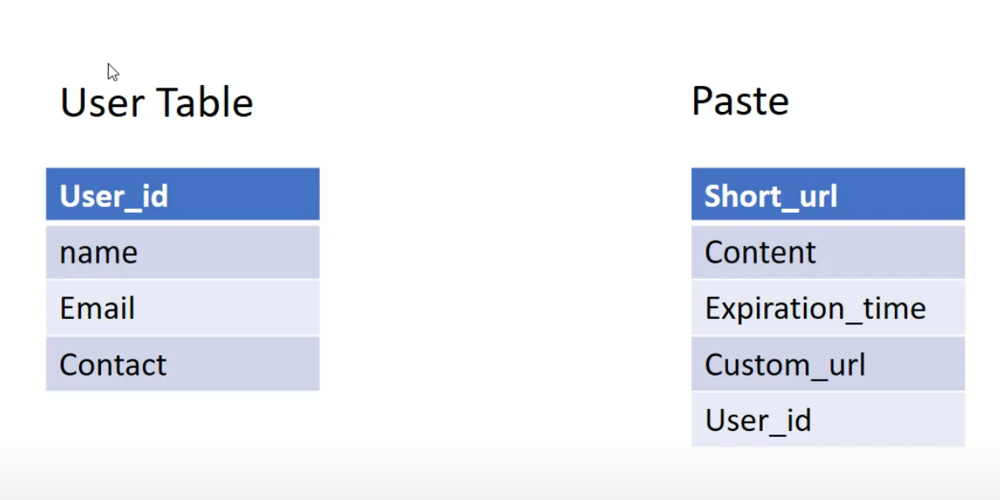

# 1. Requirement Gathering

### 1.1 Function Requirements. :

1. User should able to past content and get URL
2. When click on the URL user should redirect to the content
3. User can give expiration time for a URL
4. User can give custom URL.

### 1.1 Non-Functional Requirements.

1. High availability
2. Low latency
3. Scalable
4. Secure

---

---

### 2. API Design :

1. **POST : Create_past(content, user_id,expiration_time, custom_url)**
2. **GET : Get_url(past_url)**

---

---

### 3. Database Design :

To store content we will use objects store i.e (AWS S3).

-   Use can use key generation services to generate 6 digit key and store it to key database
-   Use can use this key as past URL for every newly created past

---

---
